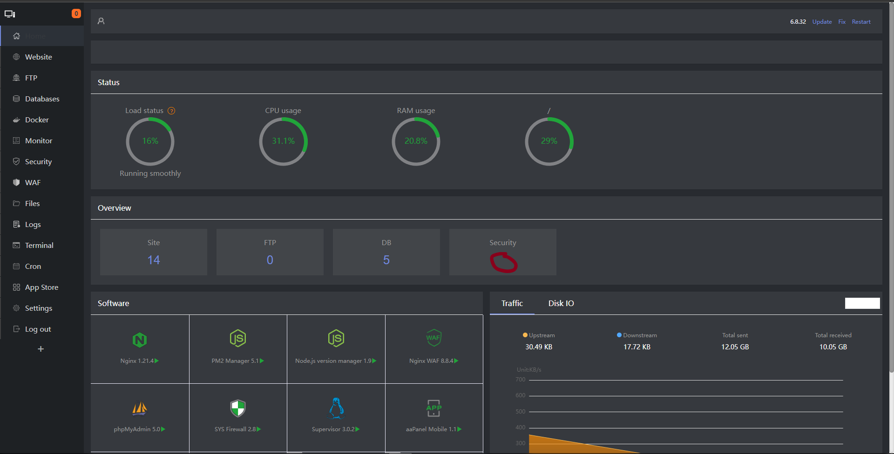

# AAPanel Theme Changer



AApanel Theme Changer is a script to easily change the theme of the AAPanel site. This script allows users to apply a predefined theme to the site's CSS file, providing a more personalized experience. The script is a WIP so if you want to contribute, feel free to do so. There are many issues that need to be fixed and many features that need to be added.

## Features

- Change the background color, theme color, secondary color, tertiary color, tab highlight, left tab, and general text.
- Create backups before applying theme changes.
- Restore from backups.

## Usage

### Prerequisites

- This script is designed for Linux operating systems.
- Run the script as a sudo user by preference.

### Commands

#### Apply Theme

```bash
sudo python script.py
```

#### Reset to Backup

```bash
sudo python script.py --reset
```

## Known Issues

- `.file_bodys` doesn't change background-color.
- `#20a53a` is not always changed to `theme_color`.
- `.cw` class is overwritten by `background_color` in the theme and it shouldn't.
- `.btn-default` classes are not taken into account by this script for some reason.
- Many `:hover` classes are not taken into account by this script for some reason.
- `input`, `textarea`, `select`: should have a darker background like `tab_highlight` color.

## Contributions

Contributions to enhance the script or fix bugs are welcomed. Feel free to fork the repository, make improvements, and submit pull requests.